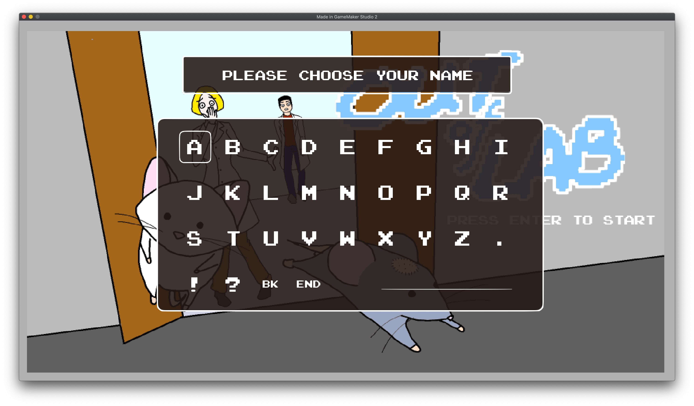
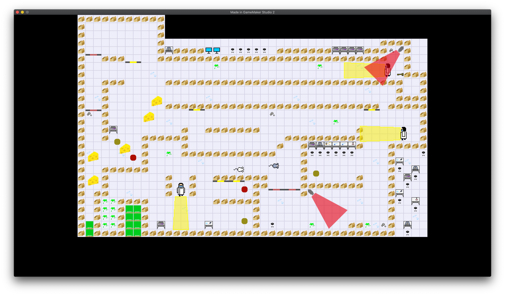
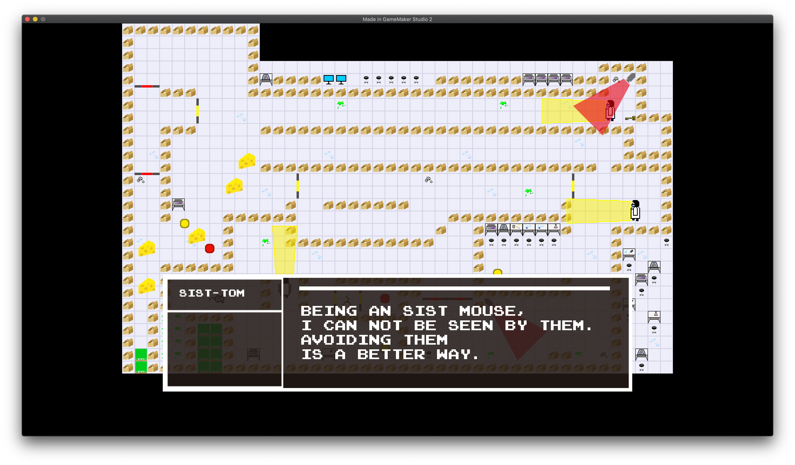

# Portfoilo No.3: A Game Made with Teammates Using GameMaker Studio

## Demo Showcase

- [Video record about the game on Youtube](https://youtu.be/GJWobm59nBI) 

- The screenshots of the game.

	
	
	
		
	
	
## About this Project

This is a 2D game designed by: Yimo Chen, Zhenyu Cui, Chengyue Jiang, Tong Guo, Xue Xiao In 3 days during the summer school course: Game Design(InnoLab) using GAMEMAKER studio.

The GameMaker Studio uses its own language to program, we did not use visualized programming in this project.

## Things I Have Done in This Project

- Overall game design and mechanisms.
- UI design.
- Code related to dialog system and triggers for story.
- Code related to some sound effect.

## Things Done by My Teammates

- Tilesets, Sprites and artworks of images.
- Code related to movements of characters and collision detection.
- Testing and recoring glitches in the game.
- Synchornizing the progress of each one of us in the team and code management.

## Things from the Internet

- The font: [EMULOGIC](https://www.fontspace.com/freaky-fonts/emulogic) ,which mimics the font style on a Nintendo Entertainment System.
- Music. The title screen music is an 8-bit remake of the main theme of Luigi Mansion series. The main music is downloaded from the copyright free music website.
- Many of the sound effects are direct records from the game: The Legend of Zelda on NES.